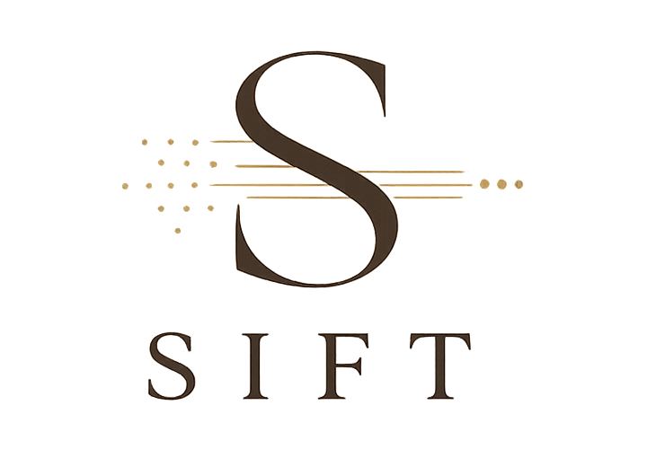
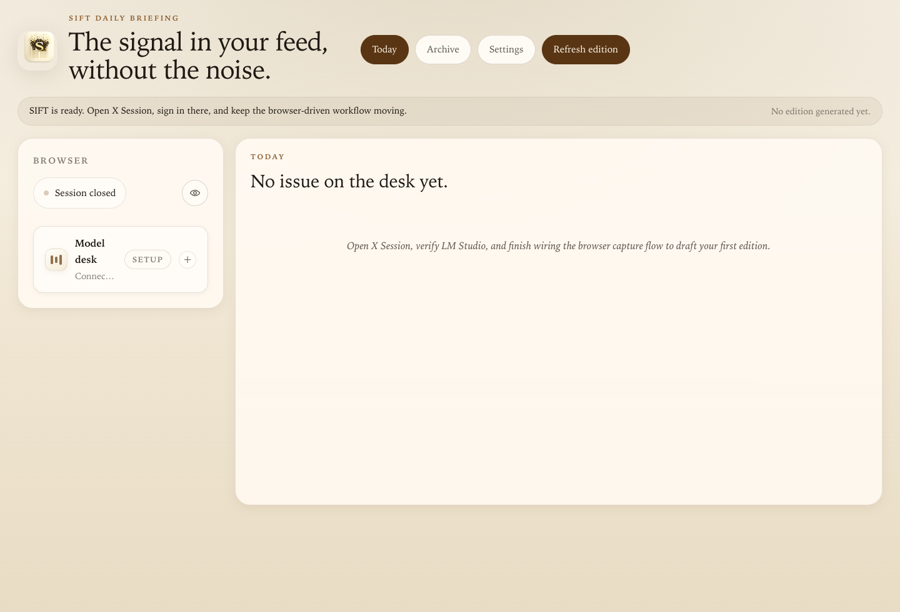

<p align="center">
  
</p>

# SIFT

SIFT is a local-first desktop newsroom for your social feeds. It turns posts flowing through dedicated SIFT-managed X, LinkedIn, and Reddit sessions into concise daily editions, ranks the most relevant stories with LM Studio, and keeps a searchable local archive on your machine.

<p align="center">
  
  
  
</p>

> SIFT is an independent tool and is not endorsed by, affiliated with, approved by, or sponsored by X Corp., LinkedIn, or Reddit.



## What SIFT does

- Opens dedicated native X, LinkedIn, and Reddit sessions inside the app so feed capture stays tied to app-managed browser contexts.
- Pulls fresh posts from your X Home timeline, LinkedIn home feed, and signed-in Reddit home feed instead of relying on the legacy X API flow.
- Lets you choose whether each refresh should use X, LinkedIn, Reddit, or any supported combination together.
- Lets you control how many feed pages SIFT browses per enabled source before it starts drafting the digest.
- Cleans the feed with local rules such as hiding replies, hiding reposts, removing engagement bait, and muting authors or keywords.
- Groups related posts into topic clusters, asks LM Studio to rank them, and writes a newspaper-style edition.
- Produces source-aware desk views so you can switch between Consolidated, X-only, LinkedIn-only, and Reddit-only editions.
- Stores editions, sync history, and feed metadata in a local SQLite database inside the Tauri app data directory.
- Can refresh on demand or on a daily schedule and surfaces desktop notifications when an edition completes or fails.

## How it works

1. Open the browser sessions you want SIFT to use, then sign in to X, LinkedIn, and/or Reddit there.
2. In `Settings`, choose whether SIFT should capture from X, LinkedIn, Reddit, or any combination, and set how many pages it should browse per enabled source.
3. Start LM Studio locally, load a model, and verify the connection in `Settings`.
4. When you refresh, SIFT drives each enabled session back to its home feed and captures fresh posts from those live sessions.
5. The Rust backend filters and deduplicates posts, then groups them into clusters.
6. LM Studio ranks the clusters and helps draft headlines, summaries, and the front-page brief.
7. SIFT saves the finished edition views locally and shows them in the `Today` and `Archive` tabs as `Consolidated`, `X`, `LinkedIn`, and `Reddit`.

## Multi-source capability

SIFT now supports a shared multi-source capture workflow:

- `X`: captures from the X home timeline using the existing browser-session flow.
- `LinkedIn`: captures from the LinkedIn home feed using a dedicated browser-session flow.
- `Reddit`: captures from the signed-in Reddit home feed using a dedicated browser-session flow.
- `Consolidated`: combines enabled-source captures into one shared ranking and digest-generation pass.

The processing pipeline after capture stays shared across sources:

- cleanup filters still apply before ranking
- clustering and LM Studio ranking still happen in Rust
- saved editions are still local-first and archived on disk

When both sources are enabled, one refresh produces:

- a `Consolidated` desk view
- an `X` desk view
- a `LinkedIn` desk view
- a `Reddit` desk view for any enabled Reddit source

## Stack

- Tauri 2 for the desktop shell and native integrations
- React 19 + Vite 8 for the UI
- Rust for capture orchestration, scheduling, notifications, and persistence
- SQLite for local storage
- LM Studio for local model inference

## Install locally

### 1. Install platform prerequisites

SIFT is a Tauri app, so you need the normal Tauri desktop toolchain plus Node.js and Rust.

- macOS: install Xcode or run `xcode-select --install`
- Windows: install Visual Studio Build Tools with `Desktop development with C++`; WebView2 is required and is already present on most modern Windows 10/11 installs
- Linux (Debian/Ubuntu):

```bash
sudo apt update
sudo apt install libwebkit2gtk-4.1-dev build-essential curl wget file libxdo-dev libssl-dev libayatana-appindicator3-dev librsvg2-dev
```

- Rust: install stable Rust with `rustup`

```bash
curl --proto '=https' --tlsv1.2 https://sh.rustup.rs -sSf | sh
```

- Node.js: install the current LTS release from [nodejs.org](https://nodejs.org/)

Official Tauri prerequisite docs: [Prerequisites](https://v2.tauri.app/start/prerequisites/)

### 2. Clone and install dependencies

```bash
git clone <your-repo-url>
cd Sift
npm ci
```

### 3. Start LM Studio

SIFT expects a local LM Studio server and a loaded model before sync can complete.

- Default base URL: `http://127.0.0.1:1234`
- Default preferred model in the UI: `google/gemma-4-26b-a4b`

### 4. Run the app in development

```bash
npm run tauri:dev
```

The Tauri wrapper script in [`scripts/run-tauri.mjs`](scripts/run-tauri.mjs) helps discover common Rust install paths if your shell has not picked up `cargo` yet.

## Useful commands

```bash
# Frontend unit tests
npm test

# Rust tests
cargo test --manifest-path src-tauri/Cargo.toml

# Build the frontend only
npm run build

# Build desktop bundles locally
npm run tauri:build
```

## Local setup checklist

1. Install Node.js LTS and Rust stable.
2. Install the Tauri OS dependencies for your platform.
3. Run `npm ci`.
4. Start LM Studio and load a model.
5. Run `npm run tauri:dev`.
6. Open the X, LinkedIn, and/or Reddit sessions you want to use, sign in, configure sources and browse depth in `Settings`, verify LM Studio, and refresh the edition.

## CI/CD

This repo includes two GitHub Actions workflows:

- `ci.yml`: runs tests, then builds desktop bundles for Linux, Windows, and macOS and uploads the bundle directories as workflow artifacts.
- `release.yml`: runs on version tags like `v0.1.0`, verifies the tag matches the app version, reruns tests, and publishes release assets to GitHub Releases.

When cutting a release, keep the version in `package.json`, `src-tauri/tauri.conf.json`, and `src-tauri/Cargo.toml` aligned before pushing the `v*` tag.

## License

MIT. See [LICENSE](LICENSE).
